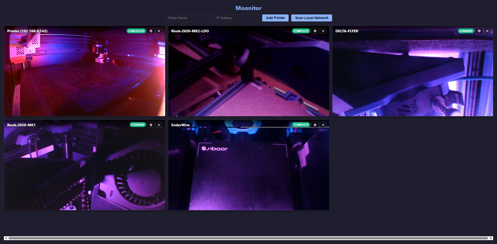
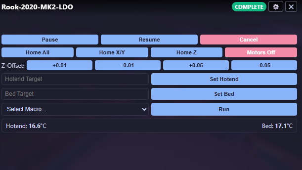
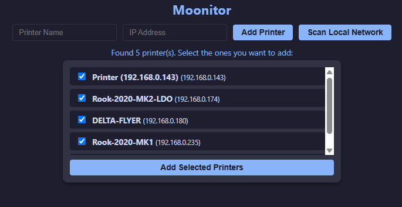

<p align="center">
  
</p>

# Moonitor

**A lightweight, zero-latency fleet dashboard for Klipper and Moonraker.**

Moonitor is a unified browser interface designed to let you monitor and control multiple 3D printers from a single screen. 

It is built on the philosophy that **individual Klipper hosts should remain localized in their respective printers.** Instead of trying to centralize hardware connections onto one massive host machine, Moonitor acts strictly as a lightweight HTML thin-client dashboard. It handles the high-level UI while letting your individual printers do the heavy lifting.

## Gallery

| Fully Configured Fleet Dashboard | Hover Control Overlay |
| :---: | :---: |
|  |  |
| *Managing multiple Klipper nodes from a single window.* | *Access instant controls, telemetry, and macros on hover.* |

| Network Scan Results |
| :---: |
|  |
| *Easily discover and batch-add local Moonraker endpoints.* |

## Features

* **Network Discovery:** Built-in mDNS scanning automatically finds Moonraker instances on your local network - no hunting for IP addresses.
* **Zero-Latency Telemetry:** Connects directly to each printer's Moonraker WebSockets from your browser for instant temperature and status updates.
* **Grid-Based Command Center:** View all your webcam streams side-by-side in a responsive CSS grid that adapts to your screen size.
* **Essential Controls:** Start, pause, cancel, adjust Z-offset, set temperatures, home axes, and trigger custom macros across your entire fleet from one window.
* **Persistent Storage:** Saves your fleet configuration locally so your dashboard is exactly how you left it after a reboot.
* **Flexible Camera Controls:** Enable, disable, rotate (0°, 90°, 180°, 270°), and horizontally mirror your webcam feeds directly from the printer settings to fit any enclosure orientation.

## Architecture

* **Backend:** A tiny Node.js server that handles local network scanning (mDNS/Bonjour) and serves the static UI files.
* **Frontend:** Vanilla JavaScript and HTML. The frontend talks directly to the Moonraker WebSockets, bypassing the Node backend entirely for live printer control. 

## Quick Install

You can install Moonitor directly on one of your existing Klipper hosts (like a Raspberry Pi) or a dedicated local home server. 

Run this command via SSH on your target Debian/Ubuntu machine to automatically install Node.js, download Moonitor, and set it up as a background service:

```bash
curl -sSL https://raw.githubusercontent.com/Kanrog/Moonitor/main/install.sh | bash
```

Once installed, open a browser on your network and navigate to `http://<YOUR_HOST_IP>:3366`.

## Install as an App (PWA)

Moonitor includes full Progressive Web App (PWA) support, allowing you to install it directly to your desktop or mobile home screen as a standalone application.

**How to install:**
* **Desktop (Chrome/Edge):** Open Moonitor in your browser and click the small "Install App" icon located on the right side of your URL address bar.
* **Mobile (iOS/Android):** Open Moonitor in Safari or Chrome, tap the "Share" or "Menu" button, and select "Add to Home Screen". 

Once installed, Moonitor will run in its own dedicated window without browser tabs or toolbars, giving you a clean, native dashboard experience for your fleet.

**Note on Moonraker CORS:**
Ensure your `moonraker.conf` allows connections from your local subnet, or Moonraker will block Moonitor's WebSocket requests. Add your local IP range (e.g., `192.168.0.0/16`) to the `trusted_clients` list under the `[authorization]` section.

### Creality K2 / K2 Plus Camera Note
The Creality K2 series uses a proprietary WebRTC camera stream instead of a standard MJPEG endpoint. If your camera feed fails to load, ensure you have a local stream bridge (such as `go2rtc` or a community-supported helper script) configured on your printer to translate the stream into an accessible format.

## Uninstall

If you ever need to remove Moonitor from your host system, you can use the automated uninstall script. This will stop the background service, remove it from systemd, and delete the Moonitor project directory. It will safely leave Node.js and Git installed so it does not interfere with other services on your machine.

Run this command via SSH to completely remove Moonitor:

```bash
curl -sSL https://raw.githubusercontent.com/Kanrog/Moonitor/main/uninstall.sh | bash
```
