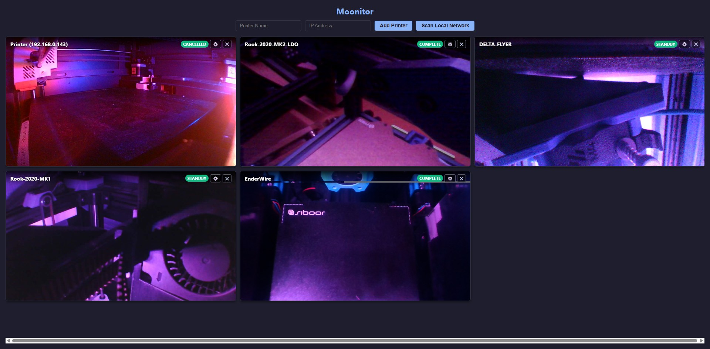
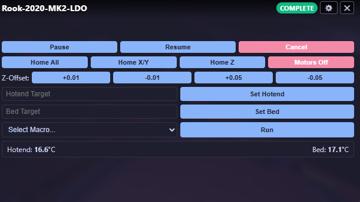
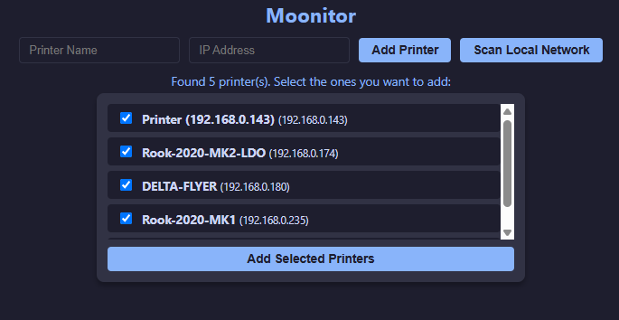
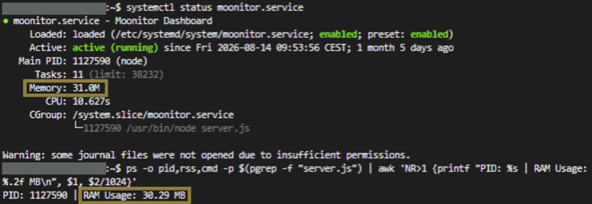

<p align="center">
  
</p>

# Moonitor

**A lightweight, zero-latency fleet dashboard for Klipper and Moonraker.**

Moonitor is a unified browser interface designed to let you monitor and control multiple 3D printers from a single screen. 

It is built on the philosophy that **individual Klipper hosts should remain localized in their respective printers.** Instead of trying to centralize hardware connections onto one massive host machine, Moonitor acts strictly as a lightweight HTML thin-client dashboard. It handles the high-level UI while letting your individual printers do the heavy lifting.

---

## Who is it for?

Moonitor is built for makers and creators running multiple Klipper-based 3D printers who are tired of juggling dozens of browser tabs or trying to remember local IP addresses. Instead of bouncing between separate interfaces just to check a first layer or cancel a failed print, Moonitor pulls your entire fleet into a single, cohesive dashboard view right in your browser.

Integrated network discovery automatically tracks down your machines, and everyday controls—like pausing, homing, tweaking a Z-offset, or firing off a custom macro—are instantly accessible.
Whether you prefer a bird's-eye view, highlight mode with a bottom thumbnail strip, or an auto-cycling carousel, Moonitor adapts to how you work.

Beyond core fleet control, Moonitor is packed with thoughtful touches to match your workshop workflow. Since webcams rarely align naturally in multi-printer setups, built-in camera orientation tools let you easily rotate and mirror your video feeds to match your physical enclosures. You can customize the look of your dashboard using a choice of preset themes or a fully tailored color palette, while an optional, lightweight RAM monitor gives you discreet real-time visibility into both app-specific memory and overall host system resource usage.

---

## Gallery

| Fully Configured Fleet Dashboard | Hover Control Overlay |
| :---: | :---: |
|  |  |
| *Managing multiple Klipper nodes from a single window.* | *Access instant controls, telemetry, and macros on hover.* |

| Network Scan Results |
| :---: |
|  |
| *Easily discover and batch-add local Moonraker endpoints.* |

---

## Features

* **Network Discovery:** Built-in mDNS scanning automatically finds Moonraker instances on your local network - no hunting for IP addresses.
* **Zero-Latency Telemetry:** Connects directly to each printer's Moonraker WebSockets from your browser for instant temperature and status updates.
* **Grid-Based Command Center:** View all your webcam streams side-by-side in a responsive CSS grid that adapts to your screen size.
* **Essential Controls:** Start, pause, cancel, adjust Z-offset, set temperatures, home axes, and trigger custom macros across your entire fleet from one window.
* **Persistent Storage:** Saves your fleet configuration locally so your dashboard is exactly how you left it after a reboot.
* **Flexible Camera Controls:** Enable, disable, rotate (0°, 90°, 180°, 270°), and horizontally mirror your webcam feeds directly from the printer settings to fit any enclosure orientation.
* **CustomisableThemes:** Includes 6 preset color themes (Moonitor Dark, Cyberpunk Neon, Emerald Mint, Sunset Ember, Monolith, and Purple Vibe) plus a fully customizable color palette to adjust backgrounds, text, buttons, button text, and outlines with persistent `localStorage` saving.

> ### Creality K2 / K2 Plus Camera Note
> The Creality K2 series uses a proprietary WebRTC camera stream instead of a standard MJPEG endpoint. If your camera feed fails to load, ensure you have a local stream bridge (such as `go2rtc` or a community-supported helper script) configured on your printer to translate the stream into an accessible format.

---

## Architecture

* **Backend:** A tiny Node.js server that handles local network scanning (mDNS/Bonjour) and serves the static UI files.
* **Frontend:** Vanilla JavaScript and HTML. The frontend talks directly to the Moonraker WebSockets, bypassing the Node backend entirely for live printer control. 

---

## System Requirements & Performance

Moonitor is built as a true thin-client. The Node.js backend exists solely to serve the static UI files and run local network discovery. All live telemetry, commands, and camera streams are handled directly between your browser and the printer's WebSockets.

Because of this architecture, Moonitor has virtually zero system overhead. In real-world testing, a Moonitor service managing an active fleet of 5 printers consumes roughly **35 MB of RAM** (*65 MB with 9 printers*) with no memory leaks after over a month of continuous uptime. It can comfortably run directly on an existing Pi or Debian SBC alongside Klipper without impacting your print quality or host performance. It can also be hosted on a home server.

> **Note** *Running Moonitor alongside klipper on a SBC with only 512 MB of RAM is not recommended, use a host with minimum 1 GB of RAM*

| Memory & Performance Benchmark |
| :---: |
|  |
| *Consuming ~31 MB of RAM after over a month of continuous uptime across 5 printers.* |

---

## Quick Install

You can install Moonitor directly on one of your existing Klipper hosts (like a Raspberry Pi) or a dedicated local home server. 

Run this command via SSH on your target Debian/Ubuntu machine to automatically install Node.js, download Moonitor, and set it up as a background service:

```bash
curl -sSL https://raw.githubusercontent.com/Kanrog/Moonitor/main/install.sh | bash
```

Once installed, open a browser on your network and navigate to `http://<YOUR_HOST_IP>:3366`.

---

> **Note on Moonraker CORS:**
> Ensure your `moonraker.conf` allows connections from your local subnet, or Moonraker will block Moonitor's WebSocket requests. Add your local IP range (e.g., `192.168.0.0/16`) to the `trusted_clients` list under the `[authorization]` section.

---
## Install as an App (PWA)

Moonitor includes full Progressive Web App (PWA) support, allowing you to install it directly to your desktop or mobile home screen as a standalone application. Once installed, Moonitor will run in its own dedicated window without browser tabs or toolbars, giving you a clean, native dashboard experience for your fleet.

**How to install:**
* **Desktop (Chrome/Edge):** Open the browser's main menu (three dots in the top right), navigate to **"Save and share"** (or "Apps"), and click **"Install page as app"**.
* **Mobile (iOS/Android):** Open Moonitor in Safari or Chrome, tap the "Share" icon (iOS) or the three-dot "Menu" (Android), and select **"Add to Home Screen"**.

> **Troubleshooting: "This app cannot be installed" / Missing Install Button**
> Because Moonitor runs locally over standard HTTP, modern browsers (like Chrome on Android or Desktop) may flag the connection as insecure and gray out the true "Install" button, only allowing you to create a standard browser shortcut.
> 
> **To fix this and force a full app installation:**
> 1. Type `chrome://flags/#unsafely-treat-insecure-origin-as-secure` (or `edge://flags` for Edge) into your browser's address bar.
> 2. Change the setting from **Default** to **Enabled**.
> 3. Type your exact Moonitor address (e.g., `[http://192.168.0.215:3366](http://192.168.0.215:3366)`) into the text box provided.
> 4. Tap the **Relaunch** button to restart the browser.
> 5. Navigate back to your Moonitor dashboard and open the menu again. The **Install** option will now be fully enabled!

---

## Updating Moonitor

Moonitor does not include an auto-updater to keep the dashboard as lightweight and secure as possible. Instead, the four commands needed to update it has been simplified into one.

To update your installation to the latest version, SSH into the machine hosting Moonitor (your Klipper host or home server) and run this following command to pull the latest code, update any dependencies, and restart the background service:

```bash
./Moonitor/update.sh
```

Please note that this only works if you installed Moonitor after August 13th 2026.
If you have an earlier version, you need to reinstall Moonitor.

---

## Uninstall

If you ever need to remove Moonitor from your host system, you can use the automated uninstall script. This will stop the background service, remove it from systemd, and delete the Moonitor project directory. It will safely leave Node.js and Git installed so it does not interfere with other services on your machine.

Run this command via SSH to completely remove Moonitor:

```bash
curl -sSL https://raw.githubusercontent.com/Kanrog/Moonitor/main/uninstall.sh | bash
```

**In development**

Moonitor is in constant development, if you have issues, feature requests or questions, please dont be afraid to leave a ticket int the [issues tab](https://github.com/Kanrog/Moonitor/issues).